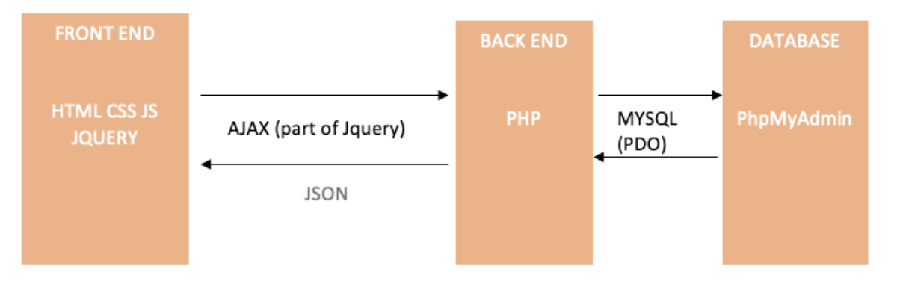
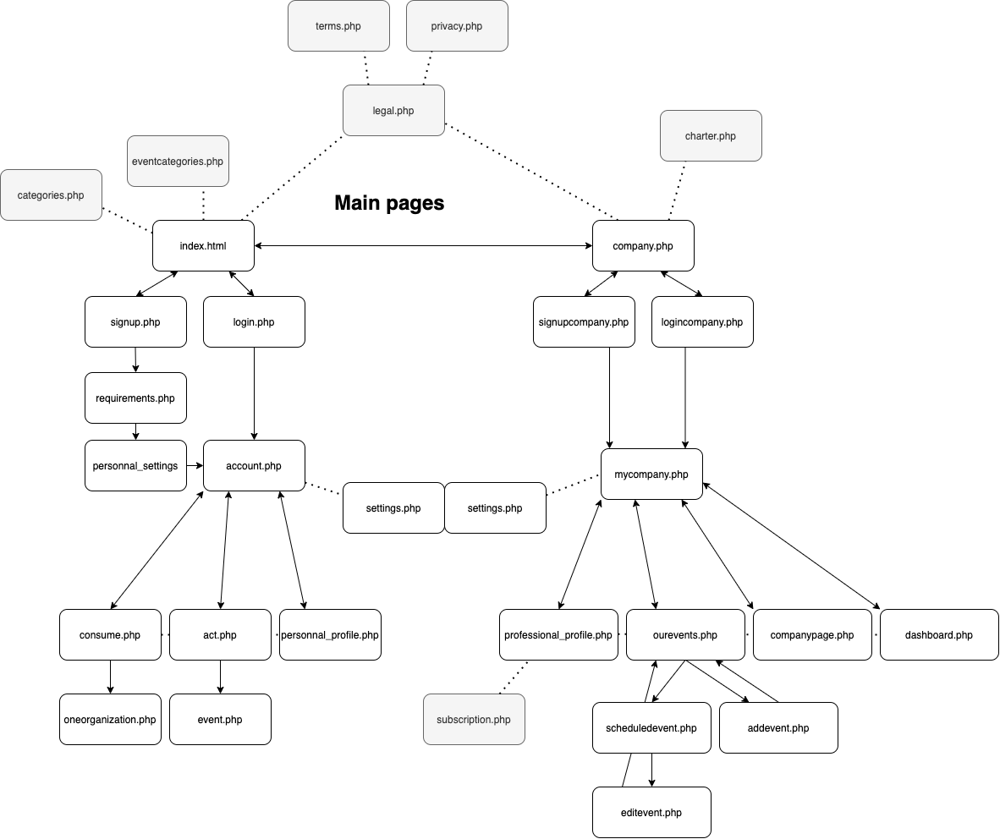
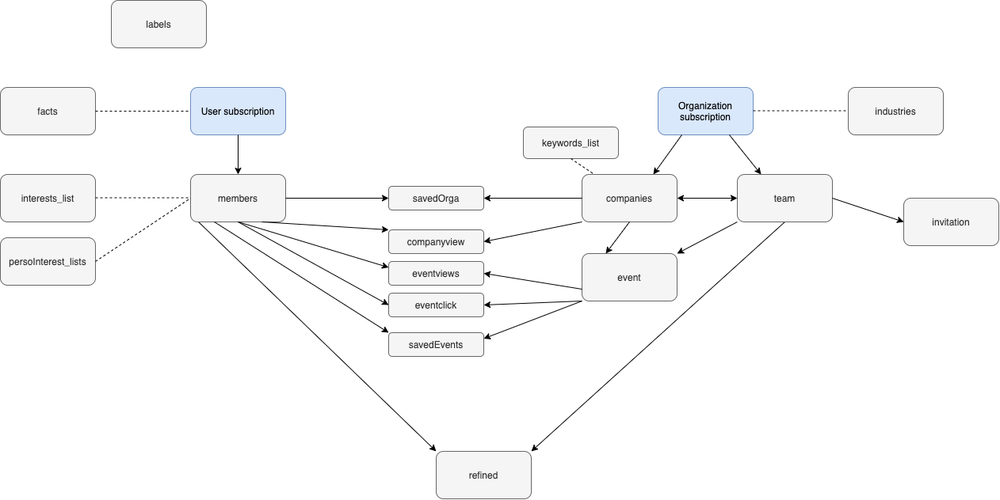

READ ME - green'it 
=======

https://greenit.co

In recent years, the world has seen an increase in ecological awareness. The issue of decarbonization is colossal and may seem abstract. If there is a wave of people ever more conscient that change is needed, still more concrete action must happen towards sustainability. The sheer size of this purpose can make us feel unable to take part in it. 

green'it is a website that will help decarbonize our world. **We are the catalyst for all individuals who want to take part in action**, but may not know how. We want to make sure they can translate these values into action. As society turns more and more digital, we want to make use of digital for decarbonization focusing on what it offers best: connectivity and practicality. 

green'it is a platform that connects you to a network of enterprises which are verified to be engaged in sustainable consumption, as well as to a range of green associations that are looking for help in environment protection activities. The objective is to list as many actors as possible who can help us adopt an **eco-friendly lifestyle**. By offering convenience, we expect users to take more initiative to reduce their carbon footprint. 

The website offers two connected spaces : 
* **Act for the future:** dedicated to sustainability focused events
* **Consume sustainably:** dedicated to organizations offering responsible goods and/or services.

If most of us know the task is huge, we are here to help make it more tangible. Each of our users, having access to a network tailored to their interests, can take part in the fast-approaching era of decarbonization. **By centralizing quality information**, being **convenient** and providing a **personalized service**, green'it wants to prove that deciding to take part can be easy.

TESTS
-----------

**Uses cases**

In the technical documentation folder, you can find complete uses cases to fully understand our users journeys.

**Test cases**

In the technical documentation folder, you can find tests cases that we used for the development stage.

**Data for testing**

We have prepared some fictionnal data that you will need to test this web app. You can find those in the technical documentation folder.

*We hope you will like our web app. Enjoy with green'it.*

Architecture
-----------

**General Architecture (3-parts)**

Given the limited time, we have chosen all the simplest and fastest elements to implement the platform. Keeping in mind and anticipating that in a near future, we must evolve it towards a more efficient and robust architecture (see backlog section for more details).

So for now, greenit is organized in a classic 3 part architecture as shown in the sketch below: 

**Cloud solution**

Always based on the same logic of choosing the most effective approach, the app is hosted in OVH, because their setup corresponds perfectly to our 3 part architecture, having by default in their offers all the components that we need (mail server, PhpMyAdmin database, SSL certificate, Web Server supporting php, automatic & management backup, analytics …).

More information about our subscription plan and options can be found by clicking on the link below:
[OVH website](https://www.ovh.co.uk/web-hosting/web-hosting-pro.xml)

Furthermore, we can upgrade our capacities very quickly by switching to a more efficient offer. OVH allows us to quickly improve our  available infrastructures by switching to a bigger subscription pack. It represents the flexibility that we need to support our scalability in the near future.

As a bonus: OVH is a French company, which means we can check that they are in accordance with a majority of green’it principles (especially respect of human rights, environment efforts…)

**Application architecture (functional modules)**

In the technical documentation folder, you can find our functional modules in details (pages and their link).

Here you can find a general overview of our website's organization: 

**Database**

To deal with our data, we are using Phpmyadmin, to manage a MySQL database. The tables and their respective links (using unique auto-incremented ID) can be seen on the graph below: 

OVH automatically manages regular backups.

**Software design patterns**

In our javascript code, we are using the javascript module pattern, which is the most widely used design pattern for keeping particular pieces of code independent of other components. 
No specific design pattern is currently used in php.

**Programming Languages**

___Frontend___: HTML/CSS/JS/JQUERY

Communication between Back end & front end : Ajax (part of Jquery)

___Backend___: PHP/MySQL 
We chose these easy-to-implement languages to start our project, given the limited time and the fact that these languages can be set up quickly with little infrastructure requirements. Furthermore, offered performances  are sufficient for the app in its current state. We are planning and anticipating evolutions for when performances will no longer be sufficient. 

In fact, we can switch to more performing languages in terms of data volume treatment, by using for example the well known couple NodeJS & Express.

**External libraries & APIs**

→ External libraries

- Jquery UI : [link]https://jqueryui.com
	*Jquery library to easily generate and customize UI elements. We use it to generate calendars in date fields (Datepicker).*

- PhpMailer : [link]https://github.com/PHPMailer/PHPMailer
 	*Php library to send emails*

- Cropperjs (crop pictures) : [link]https://fengyuanchen.github.io/cropperjs/
	*JS library to generate a canva and permit users to crop their imported pictures.*

→ API’s  

- API SIRENE (provided by French government to access to database of French companies & associations SIRET number)
*We are sending https requests to check the siret number and verify the  identity of organizations when they are subscribing.*

- API RNA (provided by French government to access to database of French non-profit organizations’ RNA number)
*We are sending https requests to check the RNA number and verify non-profit organizations’ identity when they are subscribing.*

**Taking into account non-functional requirements : Stateless, Availability, Scalability, Security**

In terms of security, we are dealing with restricted access through session variables provided by php. Authentication is managed with email and a home-made unique encryption for the password. We are also using a SSL Certificate provided by OVH (LETSENCRYPT DV), with an automated redirection managed with a .htaccess file.

In terms of availability, we are receiving real time notifications from OVH if they detect a server-side issue. Concerning the client side, we are using 2 environments, one for development and one for production. We also have regular backups that could be reinstalled on the server in a matter of a few minutes.

Concerning scalability, as we have previously described, OVH offers systems which allow us to upgrade our infrastructure in less than an hour. Our actual offers contain an option that enables the server to be automatically increased if we have a sudden increase of visitors number.

**Future improvements**

In the near future, we will need to improve our infrastructure according to the success of our web app and to functionalities that we will implement. 

In this context, we are anticipating to evolve our architecture, switching to a container-based organisation, and using kubernetes to manage auto healing, auto scaling ... and our deployments. 
We could start in the near future to use automated tests.

In order to improve the availability of our website, we could use Prometeus and Grafana to manage monitoring of our website and our data.

By increasing our functionalities and in order to improve the connection between green’it containers and other apps, we will need a tool to improve our API management. We could use Kong (part of Konnect), for instance.  

In terms of security, given that the respect of private life is at the core of our business model, we will need to ensure the best practices and tools. As an example, linked with our container-based architecture and APIs, we will use an Oauth authentication process.

Lastly, as we will develop internationally and, in the short term, in France, we will need to make sure our RGPD conformity is in place. We have already started to work on this point, but we will need to improve it in the near future, taking into account each country's specificities.

Accessibility
-----------

Our web app is responsive, meaning that it offers a good user experience on browers' latest versions on modern smartphone, tablets and computer screens.

How to build
-----------

In order to build and deploy our solution, some infrastructure requirements will be needed:

- Web requirements (running server, domain name, SSL certificate…)
- Http server, Mysql & PHP.
- A running mail instance.

As a web application, it's pretty quick to deploy: configuring the database with all the tables, putting the code on the serveur and then changing the php settings files (includes/connexion.php & includes/mail_account.php).

Contact
-----------

- Hirsch Noémie: noemie.hirsch@orange.fr
- Delmas Amandine: amandinedelmas94@gmail.com
- Pechansky Ricardo: ricardopechansky@gmail.com
- Hamour Aimed: aimed.hamour@gmail.com

